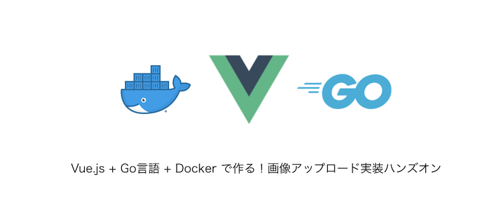
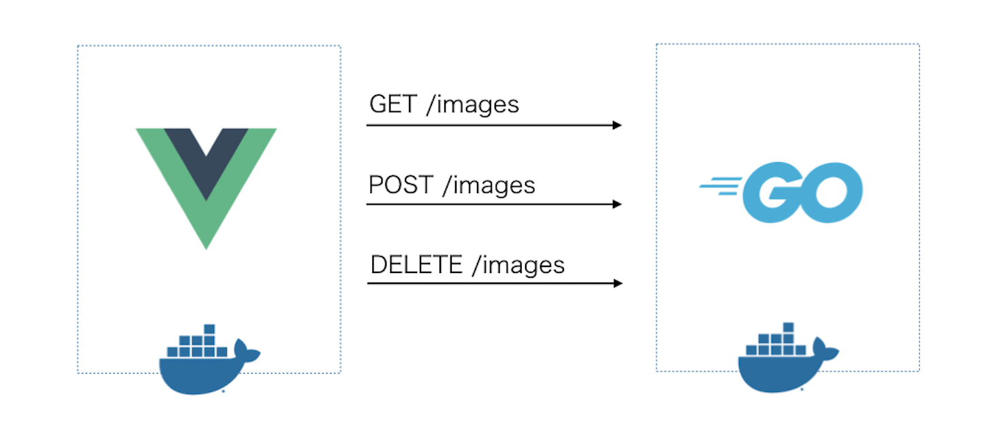
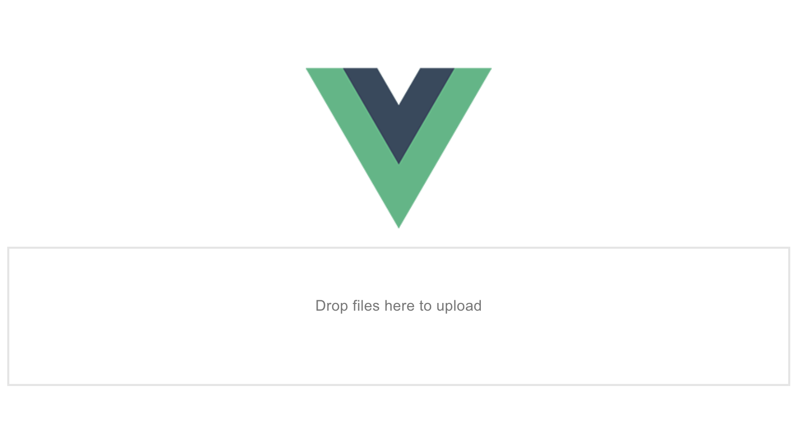
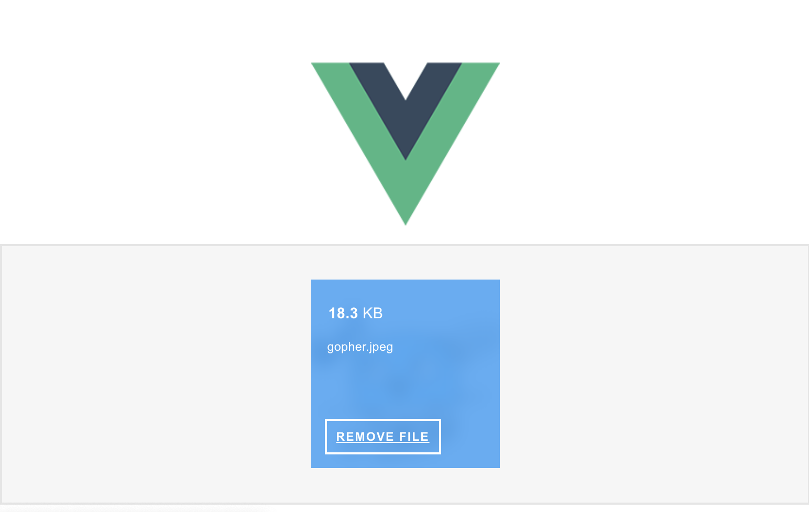

# vue-go-iamge-uploader

## Quick Start

```bash
$ mkdir sercer/images
$ cd client
$ npm install
$ cd ..
$ docker-compose up -d
```

# Vue.js + Go言語 + Docker で作る！画像アップロード機能実装ハンズオン



(この記事は Vue.js Advent Calender 2018 9日目の記事です)
https://qiita.com/po3rin/items/c70105f684e6816621d2

11月にフリーの案件で Vue.js + Go言語で画像アップロード昨日のあるCMSを作りました。Vue.jsでの実装の際には npmモジュールである ```vue2-dropzone``` を使うと、Vue.js にとって便利な機能が提供されており、すぐにアップロード機能が作れました！なので今回は Vue.js + Go言語で画像アップロードを行う機能をハンズオン形式で紹介していきます。

今回は ```vue2-dropzone``` の機能を多く使うのでこちらのドキュメントを参照しながらの実装をお勧めします。
https://rowanwins.github.io/vue-dropzone/docs/dist/#/installation

Github のリポジトリはこちら！
https://github.com/po3rin/vue-go-image-uploader

今回は Vue.jsのアドベントカレンダーとしての投稿なので、Go言語の実装を飛ばしたい方向けにGo言語のインストールが不要になるようにDocker環境で開発を行なっていきます。Go言語での実装を飛ばして試したい場合は下記のリポジトリからserverディレクトリをローカルに置いておけば大丈夫です。

## 今回の目指す形

構成は単純です。Dockerコンテナで Vue.js でクライアント、Go言語でAPIサーバーを実装します。



下のように Vue.js + Go言語で画像をアップロードを作ってみます。


当然削除やリスト機能も付けます。

## 開発用 Docker 環境構築

今まで Vue.js + Go言語の記事を何個か書いてきましたが、その際に Vue.js もしくは Go言語のセクションは飛ばしたいという方もいました。なので、どちらかが全く分からなくても動かせるように、今回は全ての開発環境をDockerで作ります。もちろん、

```bash
├── client # Vue.js によるクライアント
├── server # Go言語による APIサーバー
└── docker-compose.yml # docker-compose 設定ファイル
```

#### Vue.js の 開発用 Docker 環境

Vue.jsの開発環境をDockerで作れば、他のメンバーもすぐに同じ環境を再現できる & グローバルが汚れにくい & 本番環境も立てやすくなるので便利です。

まずは Vue CLI 3 が使えることを確認します。もし、入れたことがない場合は下記ドキュメントの手順に従います。

> Vue CLI 3 - Installation
> https://cli.vuejs.org/guide/installation.html

```bash
$ vue --version
3.2.1
```

Vue.js のプロジェクトの雛形を作ります。そのまま作られたディレクトリの中で Dockerfile を作りましょう。今回はシンプルなVueで十分なのでpreset は default を洗濯しましょう。

```bash
$ vue create client
? Please pick a preset: default (babel, eslint) # <- こちらを選択

$ cd client
$ touch Dockerfile
```

そのままDockerfileに以下の記述を記載します。

```Dockerfile
# 開発環境
FROM node:10.12-alpine as build-stage
WORKDIR /app
COPY . .
RUN yarn install
```

コンテナ内に```/app```ディレクトリを作り、 ローカルの```client```ディレクトリにあるファイルを全てコンテナにコピーし、最後に依存モジュールをインストールします。

これで このイメージにはあと``` yarn serve ```するだけでホットリロード入りの開発環境が走る状態まで出来ました。

#### Go言語の開発用 Docker 環境

(Go言語はパスしたい人や、Vue.jsのセクションだけ学びたい人は、僕の GitHub レポジトリの ```server```ディレクトリだけダウンロードすれば APIサーバーが動きます。)

```client```ディレクトリと同じ階層に```server```ディレクトリを作成します

```
$ mkdir server
$ cd server
```

今回は Go1.11から導入された vgo + modules を使って環境構築します。vgo が入っていることを確認しましょう。入ってない人は下記の手順に従ってください。

> Tour of Versioned Go (vgo)
> https://research.swtch.com/vgo-tour

```bash
$ vgo help
Go is a tool for managing Go source code.

# 省略 ...
```

```bash
$ touch go.mod main.go
```

```server/main.go``` を作ります。とりあえずはpingを返すだけで良いでしょう。

```go
package main // import "server"

import "github.com/gin-gonic/gin"

func main() {
	r := gin.Default()
	r.GET("/", func(c *gin.Context) {
		c.JSON(200, gin.H{
			"message": "ping",
		})
	})
	r.Run(":8888")
}
```

あとは ```main.go``` と同じ階層にDockerfileを作ります。

```Dockerfile
# 開発環境
FROM golang:1.11

WORKDIR /api
COPY . .
ENV GO111MODULE=on

RUN go get github.com/pilu/fresh
CMD ["fresh"]
```

ここでは ```github.com/pilu/fresh``` パッケージでAPIがホットリロードで起動します。ファイルを更新したらそのままAPIも更新されます。これで Docker 環境が整いました。

### docker-compose で起動してみる

```docker-compose.yml```を作りましょう。

```yml
version: '3'

services:
  client:
    build: ./client
    ports:
      - 8080:8080
    volumes:
      - ./client:/app
    command: yarn serve

  server:
    build: ./server
    ports:
      - 8888:8888
    volumes:
      - ./server:/api
```

これで起動するはずです。ホットリロードはファイルの更新を監視している為、volumesでローカルのファイルとコンテナ内のファイルを同期させれば、そのままローカルで作業できます。

```bash
$ docker-compose up -d
```

これで環境が整いました。実際に動くか試してみましょう。

client: localhost:8080
server: localhost:8000

client に関しては実際にブラウザで、server に関しては curlコマンドで確認してみましょう。

```bash
$ curl localhost:8888
{"message":"ping"}
```

これでDockerによる開発環境が構築出来ました。

## vue2-dropzone で 画像アップロードを作ってみる

まずは モジュールである vue2-dropzone をインストールします。ついでにサーバーにリクエストを送るための ```axios``` も後で使うので入れておきます。

```bash
$ npm install vue2-dropzone axios
```

これで 画像をアップロードできる便利なコンポーネントを使えます。早速 ```client/src/components/HelloWorld.vue``` に ```vue2-dropzone```　を追加しましょう。

```html
<template>
  <div class="hello">
    <vue-dropzone ref="myVueDropzone" id="dropzone" :options="dropzoneOptions"></vue-dropzone>
  </div>
</template>

<script>
import vue2Dropzone from 'vue2-dropzone'
import 'vue2-dropzone/dist/vue2Dropzone.min.css'

export default {
  name: 'HelloWorld',
  data: function () {
    return {
      dropzoneOptions: {
        url: `http://localhost/8888/images`,
        method: 'post'
      }
    }
  },
  components: {
    vueDropzone: vue2Dropzone
  }
}
</script>

<!-- CSS 省略 -->

```

```<vue-dropzone>``` コンポーネントは ```:option``` で設定を渡せます。今回は ```dropzoneOptions``` には ```url``` や ```method``` をセッティングしています。すでにファイルをアップロードできるフォームが出来ています。

この他に option に設定できるもののリストはこちらになります。
https://www.dropzonejs.com/#configuration-options



ここまでで画像をドロップもしくは選択できるようになってます。しかしまだアップロード先のサーバーが出来てないので、今から作っていきます。

### Go言語でアップロードを受け取るAPIサーバーを作る。

```main.go``` を修正しましょう。

```go
package main // import "server"

import (
	"server/handler"

	"github.com/gin-contrib/cors"
	"github.com/gin-gonic/gin"
)

func main() {
	r := gin.Default()

	r.Use(cors.New(cors.Config{
		AllowOrigins: []string{"http://localhost:8080"},
		AllowMethods: []string{"GET", "POST", "DELETE", "OPTIONS"},
		AllowHeaders: []string{"*"},
	}))

  r.POST("/images", handler.Upload)
	r.Run(":8888")
}

```

Go言語でJSONを扱うのが少し面倒なのでここでフレームワークの gin を使いましょう。GitHubにあるドキュメントが参考になります。
https://github.com/gin-gonic/gin

ちなみに"github.com/gin-contrib/cors"は gin 用のCORS設定パッケージです。今回は Vue から叩くのでこちらも使います。

POST メソッドで ```http://localhost:8888/images``` でファイルアップロードを受け付けます。

実際のリクエストを捌く ```handler.Upload``` メソッドを作りましょう。

handler/handler.go を作ります。

```go
package handler

import (
	"fmt"
	"net/http"

	"github.com/gin-gonic/gin"
)

// Upload upload files.
func Upload(c *gin.Context) {
	form, _ := c.MultipartForm()
	files := form.File["file"]

	for _, file := range files {
		err := c.SaveUploadedFile(file, "images/"+file.Filename)
		if err != nil {
			c.JSON(http.StatusInternalServerError, gin.H{"message": err.Error()})
		}
	}

	c.String(http.StatusOK, gin.H{"message": "success!!"})
}
```

```gin.Context``` にはアップロードされたfile達を処理するための、メソッドがいくつか生えています。

今回は ```gin.Context.SaveUploadedFile``` を使います。

```go
func (c *Context) SaveUploadedFile(file *multipart.FileHeader, dst string) error
```

指定されたディレクトリにファイルを保存します。その為、```server/images``` ディレクトリを作っておきましょう。

最終的にserver側の構成はこのようになっています。

```bash
.
└── server
    ├── Dockerfile
    ├── go.mod
    ├── go.sum
    ├── handler
    │   └── handler.go
    ├── images # image保存用
    └── main.go
```

これだけで画像アップロードを受けれます。Vue.js で作ったクライアントから画像をアップロードしてみましょう。


簡単！！これだけで画像アップロードができました。

## ファイルの名前の重複防ぐ

さてここまでだと同じ名前の画像を上げてしまうと、前にあった画像が上書きされてしまいます。そのためuuidで管理するようにしましょう。

```HelloWorld.vue```を編集しましょう。まずは ```vue-dropzone``` に ```v-on``` ディレクティブで送信直前に発火するイベントを追加しておきます。変更点はコメントアウトで補足しています。

v-onで発火させることのできるイベントはこちらで確認できます。
https://rowanwins.github.io/vue-dropzone/docs/dist/#/events

```html
<template>
  <div class="hello">

    <!-- sendingEventを追加 -->
    <vue-dropzone ref="myVueDropzone" id="dropzone" :options="dropzoneOptions"
      v-on:vdropzone-sending="sendingEvent"
    ></vue-dropzone>

  </div>
</template>

<script>
// 省略 ...

export default {
  // 省略 ...

  // methods を追加 formデータとして fileに付けられた任意のuuidを付加
  methods: {
    sendingEvent: function (file, xhr, formData) {
      formData.append('uuid', file.upload.uuid)
    }
  }
}
</script>

<!-- CSS 省略 -->

```

これで ```vue-dropzone``` が drop した file 別に付けてくれている ```uuid``` をサーバーに送れます。これを使ってサーバー側で画像をラベリングできます。

それでは ```handler/handler.go``` も uuid で画像を判別できるように編集しましょう

```go
// 省略...

func Upload(c *gin.Context) {
	form, _ := c.MultipartForm()
	files := form.File["file"]

	// uuid を所得
	uuid := c.PostForm("uuid")

	for _, file := range files {
		// ファイル名にuuidを仕込む
		err := c.SaveUploadedFile(file, "images/"+uuid+".png")
		if err != nil {
			c.JSON(http.StatusInternalServerError, gin.H{"message": err.Error()})
		}
	}

	c.String(http.StatusOK, fmt.Sprintf("%d files uploaded!", len(files)))
}
```

client から 貰った uuid を画像名にして保存します。これで重複を防げるようになりました。

## 画像の削除

やはりエンジニアたるもの、アップロードした画像を削除したくなってきます。
```vue2-dropzone``` では削除に便利な機能も提供してます。サクッと削除機能を追加しましょう。

まずは　削除機能を追加します。dropzone の設定に一行加えます。

```html
<!-- 省略 -->

<script>
export default {
  name: 'HelloWorld',
  data: function () {
    return {
      dropzoneOptions: {
        url: 'http://localhost:8888/images',
        method: 'post',
        addRemoveLinks: 'true' // ここに1行追加 !!!
      }
    }
  },
  // 省略...
}
</script>
```

これで ホバーしたら削除ボタンが表示されます。



削除ボタンを押すと、form から画像が消えます。しかし、画面上から消えるだけで、サーバーにアップロードした画像は消えていません。

削除ボタンを推すと同時にサーバーの画像を削除するリクエストを送れるようにしましょう。

```vue2-dropzone``` では削除ボタンを押した際のイベントも送信時同様、メソッドで登録できます。

```html
<template>
  <div class="hello">

    <!-- sendingEventを追加 -->
    <vue-dropzone ref="myVueDropzone" id="dropzone" :options="dropzoneOptions"
      v-on:vdropzone-sending="sendingEvent"
      v-on:vdropzone-removed-file="removeEvent"
    ></vue-dropzone>

  </div>
</template>

<script>
// 省略 ...

export default {
  // 省略 ...

  // methods を追加 formデータとして fileに付けられた任意のuuidを付加
  methods: {
    sendingEvent: function (file, xhr, formData) {
      formData.append('uuid', file.upload.uuid)
    },
    removeEvent: function (file, error, xhr) {
      axios.delete(`http://localhost:8888/images/${file.upload.uuid}`).then(res => {
        console.log(res.data)
      }).catch(err => {
        console.error(err)
      })
    }
  }
}
</script>

<!-- CSS 省略 -->

```

これで削除時にサーバーにリクエストを送り、画像を削除してもらいます。ではサーバー側で Delete API を作りましょう。

```server/main.go``` を修正します。

```go
func main() {
	r := gin.Default()

	r.Use(cors.New(cors.Config{
		AllowOrigins: []string{"http://localhost:8080"},
		AllowMethods: []string{"GET", "POST", "DELETE", "OPTIONS"},
		AllowHeaders: []string{"*"},
	}))

  r.POST("/images", handler.Upload)

  // DELETEメソッドを追加
  r.DELETE("/images/:uuid", handler.Delete)

	r.Run(":8888")
}
```

そして ```handler.go``` に Delete ハンドラーを追加します。

```go
// Delete remove file.
func Delete(c *gin.Context) {
	uuid := c.Param("uuid")
	err := os.Remove(fmt.Sprintf("images/%s.png", uuid))
	if err != nil {
		fmt.Println(err.Error())
		c.JSON(http.StatusInternalServerError, gin.H{"message": err.Error()})
		return
	}
	c.JSON(http.StatusOK, gin.H{"message": fmt.Sprintf("id: %s is deleted!", uuid)})
}
```

これで削除も完成しました。


## 画像のリストを表示する

画像をアップロードできたら当然、画像をリスト所得したくなります。ここまでの実装では ```vue2-dropzone``` では一回アップロードして、ページを更新すると何がアップロード済みかわかりません。今回は一度アップロードした画像をいつでもわかるようにします。

まずは静的ファイルがサーバーから配信できるよにしておきましょう。Nginx などを使っても良いですが、今回はGo言語で画像を返すようにします。

```main.go```を修正します。

ginが提供しているstatidファイル配信用のパッケージ ```github.com/gin-gonic/contrib/static``` を使います。

```go
package main // import "server"

import (
	"server/handler"

	"github.com/gin-contrib/cors"
	"github.com/gin-gonic/contrib/static"
	"github.com/gin-gonic/gin"
)

func main() {
	r := gin.Default()

	r.Use(cors.New(cors.Config{
		AllowOrigins: []string{"http://localhost:8080"},
		AllowMethods: []string{"GET", "POST", "DELETE", "OPTIONS"},
		AllowHeaders: []string{"*"},
	}))

	// 静的ファイル配信を追加!!
	r.Use(static.Serve("/", static.LocalFile("./images", true)))

	r.POST("/images", handler.Upload)
	r.DELETE("/images/:uuid", handler.Delete)
	r.Run(":8888")
}

```

これで localhost:8888/{uuid}.png でアクセスすればその画像が返ってくるようになります。確認してみてください。

それではクライアントで アクセス時に 画像のURLリストをAPIから所得し、すでにアップロードしていた画像を form にまとめて表示するようにしましょう。```HelloWorld.vue``` に追加します。

```html
<script>
export default {
  // 省略 ...

  mounted () {
    axios.get('http://localhost:8888/images').then(res => {
      res.data.forEach(res => {
        // filename 所得
        let filename = res.path.replace('http://localhost:8888/', '')
        // uuid 所得
        let id = filename.replace('.png', '')
        // file オブジェクト作成
        var file = {size: res.size, name: filename, type: "image/png", upload: {uuid: id}}
        // コードから　form に画像データをセット
        this.$refs.myVueDropzone.manuallyAddFile(file, res.path)
      })
    }).catch(err => {
      console.error(err)
    })
  },

  // 省略 ...
}
</script>
```

Vue.js の機能である ```mounted()``` を使ってインスタンスがマウントされた後にURLのリストを所得し、データを処理をします。

```myVueDropzone.manuallyAddFile(file, fileUrl, callback)``` は ```myVueDropzone``` から生えているメソッドです。これにファイル情報とパスを渡すことによってコードからファイルをアップロードできます。file は ```vue2-dropzone``` が期待するオブジェクトの形を渡してあげます。

```myVueDropzone.manuallyAddFile(file, fileUrl, callback)``` 以外のメソッドはこちらで確認できます。
https://rowanwins.github.io/vue-dropzone/docs/dist/#/methods

ここまできたら最後は URL とファイルサイズの JSON を返す APIを　作るだけです。
main.goに一行追加しましょう。

```go
// 省略 ...

func main() {
	// 省略 ...

  // GETを追加。!!
  r.GET("/images", handler.List)
	r.POST("images", handler.Upload)
	r.DELETE("/images/:uuid", handler.Delete)
	r.Run(":8888")
}

```

そして ```handelr.handler.go``` にコードを追加します。

```go
// 省略　...

// File has file's info.
type File struct {
	Path string `json:"path"`
	Size int64  `json:"size"`
}

func dirwalk(dir string) (files []File, err error) {
	err = filepath.Walk(dir, func(path string, info os.FileInfo, err error) error {
		path = strings.Replace(path, "images/", "http://localhost:8888/", 1)
		size := info.Size()
		f := File{
			Path: path,
			Size: size,
		}
		files = append(files, f)
		return nil
	})
	if err != nil {
		return
	}
	files = files[1:]
	return
}

// List return url & size list
func List(c *gin.Context) {
	files, err := dirwalk("./images")
	if err != nil {
		fmt.Println(err)
		c.JSON(http.StatusNotFound, gin.H{"message": err.Error()})
		return
	}
	c.JSON(http.StatusOK, files)
}

// 省略 ...
```

本来ならデータベースでファイル情報を保存しておきたいところですが、複雑になるので今回は Go言語で頑張って URL と Size をファイル情報から所得して返してます。File構造体はURLとファイルサイズを保持します。そして、少し長いですが、dirwalk関数は指定したディレクトリの中のファイルの情報群 ```[]File``` を返します。これをJSONとして返却します。

## 動作確認

アップロード、削除、ページ更新してもアップロードした画像が確認できるのを確認しましょう。


動いてます！！！

## まとめ

```vue2-dropzone``` を使ってファイルアップロードがスマートに作成できました。他にもいろんな設定ができるので、ドキュメントをご覧ください。
headerの付与や、アップロード最大数等も設定可能です。
https://rowanwins.github.io/vue-dropzone/docs/dist/#/installation

今回はサーバーのフォルダ```server/images```に直でファイルを置きましたが、実戦では API の開発に データベース、AWS S3 などを使えば更に開発しやすくなるでしょう。
